# Sicherheits-Check: Verifizierung der Gegenmaßnahmen

Dieses Dokument beschreibt, wie die Sicherheitslücken der "unsicheren" Version in diesem Projekt geschlossen wurden. Wir dokumentieren hier die Verifizierung der **sicheren Implementierung** anhand von Screenshots und Logs.

---

## Inhaltsverzeichnis
1. [Technische Voraussetzungen](#1-technische-voraussetzungen)
2. [Umgebung einrichten](#2-umgebung-einrichten)
3. [Verifizierung 1: Login Bypass (Fehlgeschlagen)](#3-verifizierung-1-login-bypass-fehlgeschlagen)
4. [Verifizierung 2: Comment-Based Bypass (Fehlgeschlagen)](#4-verifizierung-2-comment-based-bypass-fehlgeschlagen)
5. [Verifizierung 3: UNION Injection (Fehlgeschlagen)](#5-verifizierung-3-union-injection-fehlgeschlagen)
6. [Verifizierung 4: Profilmanipulation (Update Injection)](#6-verifizierung-4-profilmanipulation-update-injection)
7. [Verifizierung 5: Error-Based Injection (Fehlgeschlagen)](#7-verifizierung-5-error-based-injection-fehlgeschlagen)
8. [Ergebnis & Fazit](#8-ergebnis--fazit)

---

## 1. Technische Voraussetzungen

### 1.1 Systemanforderungen

| Komponente | Mindestanforderung |
|------------|-------------------|
| **Betriebssystem** | Windows 10/11, macOS 10.15+, oder Linux (Ubuntu 20.04+) |
| **RAM** | 8 GB (16 GB empfohlen) |
| **Festplatte** | 10 GB freier Speicherplatz |
| **CPU** | 64-bit Prozessor mit Virtualisierungsunterstützung |

### 1.2 Benötigte Software

#### Docker Desktop
Docker wird benötigt, um die MySQL-Datenbank in einem Container zu betreiben.

**Download:** https://www.docker.com/products/docker-desktop/

**Installation:**
1. Installer herunterladen und ausführen
2. Bei Windows: WSL 2 Backend aktivieren (wird während der Installation angeboten)
3. Nach der Installation: Docker Desktop starten
4. Warten bis Docker "Running" anzeigt (grünes Symbol unten links)

**Überprüfen:**
```powershell
docker --version
# Erwartete Ausgabe: Docker version 24.x.x oder höher
```

#### Java Development Kit (JDK 17+)
Das Backend ist eine Spring Boot Anwendung und benötigt Java.

**Download:** https://adoptium.net/de/temurin/releases/ (Temurin JDK 17 oder höher empfohlen)

**Installation:**
1. `.msi` (Windows) oder `.pkg` (macOS) Installer herunterladen
2. Installer ausführen und den Anweisungen folgen
3. Bei der Installation "Set JAVA_HOME variable" aktivieren

**Überprüfen:**
```powershell
java --version
# Erwartete Ausgabe: openjdk 17.x.x oder höher
```

#### Apache Maven
Maven wird benötigt, um das Java-Backend zu bauen und zu starten.

**Download:** https://maven.apache.org/download.cgi

**Installation (Windows):**
1. `apache-maven-x.x.x-bin.zip` herunterladen
2. Entpacken nach `C:\Program Files\Apache\maven`
3. Umgebungsvariablen setzen:
   - `MAVEN_HOME` = `C:\Program Files\Apache\maven`
   - `Path` um `%MAVEN_HOME%\bin` erweitern

**Installation (macOS/Linux):**
```bash
# macOS mit Homebrew
brew install maven

# Linux (Ubuntu/Debian)
sudo apt install maven
```

**Überprüfen:**
```powershell
mvn --version
# Erwartete Ausgabe: Apache Maven 3.9.x oder höher
```

#### Node.js (v18+)
Node.js wird für das Vue.js Frontend benötigt.

**Download:** https://nodejs.org/ (LTS Version empfohlen)

**Installation:**
1. Installer herunterladen und ausführen
2. Standardeinstellungen beibehalten
3. "Automatically install necessary tools" kann aktiviert werden

**Überprüfen:**
```powershell
node --version
# Erwartete Ausgabe: v18.x.x oder höher

npm --version
# Erwartete Ausgabe: 9.x.x oder höher
```

#### Postman
Postman wird verwendet, um die Requests und Angriffe durchzuführen.

**Download:** https://www.postman.com/downloads/

**Installation:**
1. Installer herunterladen und ausführen
2. Postman starten
3. Optional: Account erstellen (nicht zwingend erforderlich)


### 1.3 Schnellcheck: Alle Tools installiert?

Führe folgende Befehle aus, um zu überprüfen, ob alle Tools korrekt installiert sind:

```powershell
# Alle Versionen auf einmal prüfen
docker --version
java --version
mvn --version
node --version
npm --version
```

✅ Wenn alle Befehle eine Versionsnummer ausgeben, kannst du fortfahren!

---

## 2. Umgebung einrichten

### 2.1 Repository klonen
(falls noch nicht geschehen)
```powershell
git clone <repository-url>
cd PA02_SQL_injection
```

### 2.2 Datenbank starten
```powershell
docker compose up -d
```

### 2.3 Backend starten
```powershell
cd backend
mvn spring-boot:run
```

### 2.4 Frontend starten
(in neuem Terminal)
```powershell
cd frontend
npm install
npm run dev
```

### 2.5 MySQL CLI aufrufen
(in neuem Terminal)

Um direkt auf die Datenbank zuzugreifen, kannst du die MySQL CLI im Docker Container verwenden:

```powershell
# Container-ID herausfinden
docker ps

# MySQL CLI starten (Container-ID oder Container-Name verwenden)
docker exec -it mysql-db mysql -u demo -p demodb
# Passwort eingeben: password
```

> 💡 **Tipp:** Der Container-Name ist standardmäßig `mysql-db`.

Nützliche SQL-Befehle in der CLI:
```sql
-- Datenbank wechseln
USE demodb;

-- Alle Tabellen anzeigen
SHOW TABLES;

-- Alle Benutzer anzeigen
SELECT * FROM users;
```

### 2.6 Anwendung öffnen
- Frontend: http://localhost:5173
- Backend API: http://localhost:8080

### 2.7 Postman einrichten

**Schritt 1:** Postman öffnen

**Schritt 2:** Neue Collection erstellen (z.B. "SQL Secure Verification")

### 2.8 Testbenutzer anlegen (falls nicht vorhanden)

In Postman einen neuen Request erstellen:
- Method: `POST`
- URL: `http://localhost:8080/api/auth/register`
- Headers: `Content-Type: application/json`
- Body (raw JSON):
```json
{
  "username": "testuser",
  "password": "testpass",
  "name": "Test User",
  "email": "test@example.com"
}
```

**Schritt 3:** Login-Request erstellen (für spätere Tests):
1. In der Collection → "Add Request"
2. Name: `Login`
3. Method: `POST`
4. URL: `http://localhost:8080/api/auth/login`
5. Headers Tab: `Content-Type` = `application/json`
6. Body Tab → "raw" → "JSON" auswählen

---

## 3. Verifizierung 1: Login Bypass (Fehlgeschlagen)

### Der Angriff
Versuch, die Authentifizierung mit folgendem Payload zu umgehen:
- **Username:** `' OR '1'='1`
- **Password:** `' OR '1'='1`

### Testergebnis (Sichere Version)
Der Login wird erfolgreich blockiert. Die Anwendung verhält sich korrekt und lässt den Angreifer nicht passieren.

> 🖼️ **Beweis (Frontend):** Fehlermeldung statt erfolgreichem Login:
> 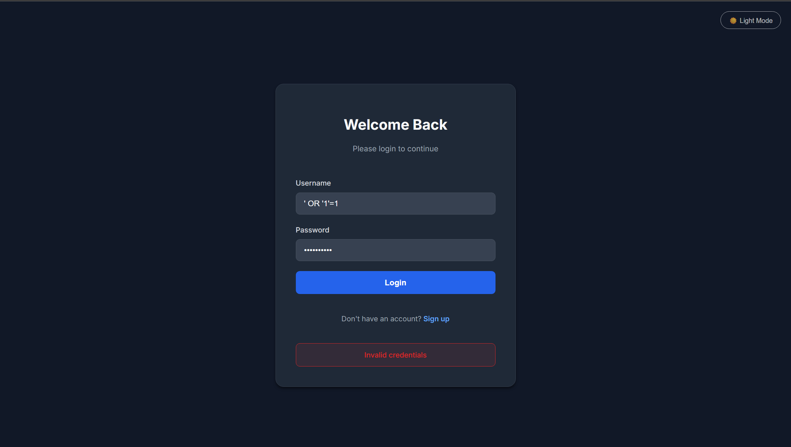
>
> 🖼️ **Beweis (Browser-Netzwerk):** Antwortstatus 400 (Bad Request) statt 200 (OK):
> 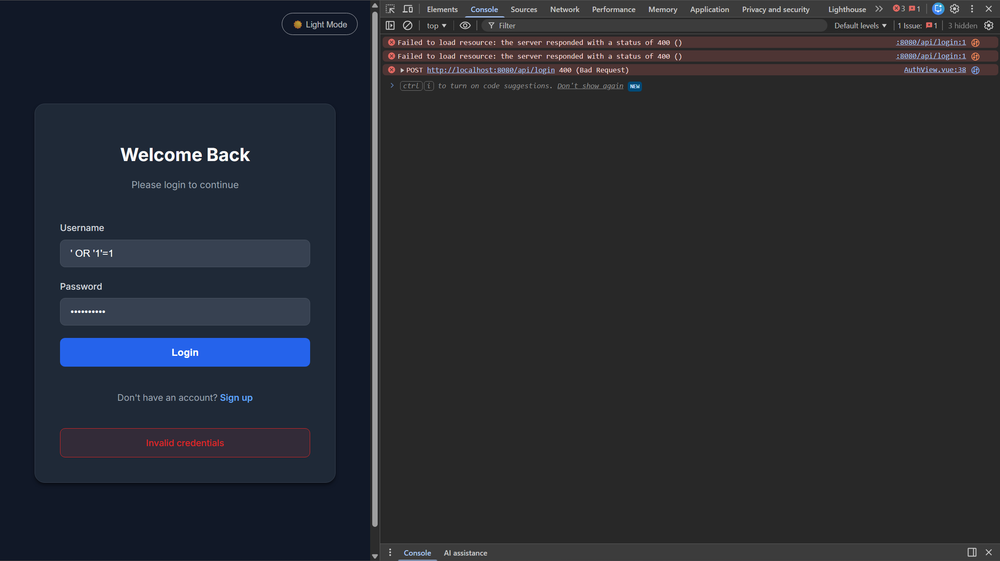
>
> 🖼️ **Beweis (Backend-Log):** Keine erfolgreiche Query-Injection sichtbar:
> 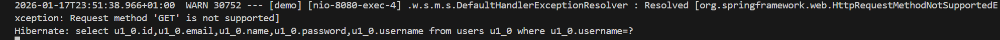


### Warum es fehlschlägt
Das Backend verwendet `UserRepository.findByUsername(username)` mit **Prepared Statements**. Die Datenbank sucht nach einem Benutzer, der buchstäblich `' OR '1'='1` heißt.

---

## 4. Verifizierung 2: Comment-Based Bypass (Fehlgeschlagen)

### Der Angriff
Versuch, den Passwort-Check mittels Kommentar-Syntax auszublenden:
- **Username:** `testuser'-- `
- **Password:** `beliebig`

### Testergebnis (Sichere Version)
Der Login schlägt fehl, da der gesamte String als Username interpretiert wird.

> 🖼️ **Beweis (Frontend):** Login verweigert:
> 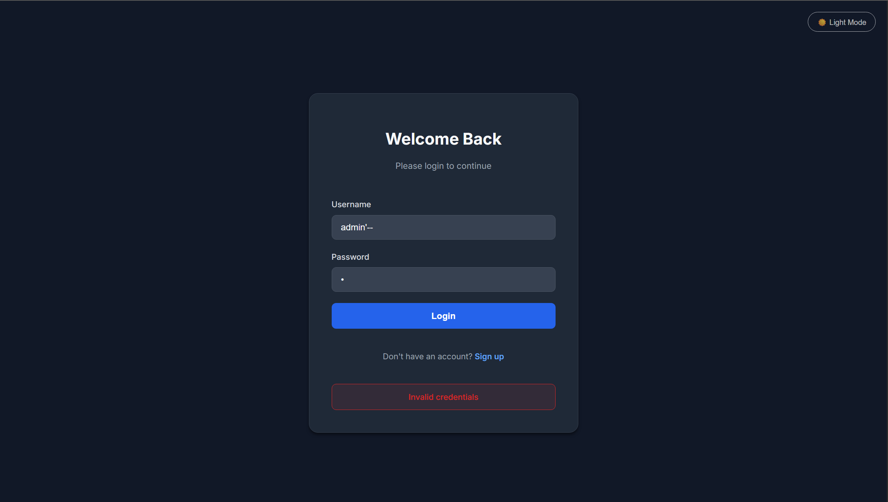
>
> 🖼️ **Beweis (Browser-Netzwerk):** Fehlerhafte Anfrage bestätigt:
> 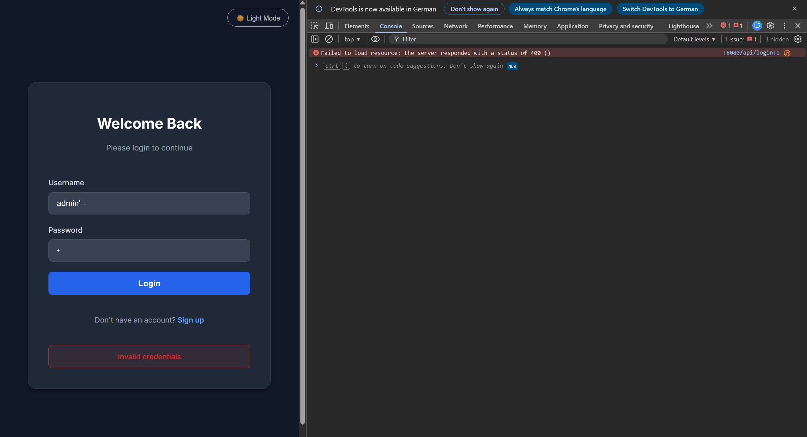
>
> 🖼️ **Beweis (Backend-Log):** Sichere Verarbeitung der Eingabe:
> 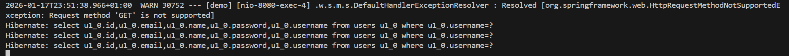

### Warum es fehlschlägt
Das Passwort wird zusätzlich in Java mit `passwordEncoder.matches()` geprüft, was SQL-Kommentare wirkungslos macht.

---

## 5. Verifizierung 3: UNION Injection (Fehlgeschlagen)

Wir haben **zwei Varianten** dieses Angriffs getestet, um sicherzustellen, dass keine Daten-Extraktion möglich ist.

### Test 1: Basis-Injection
Versuch, mittels UNION-Operator Daten aus anderen Tabellen zu extrahieren.
- **Payload:** `' UNION SELECT null-- `

#### Testergebnis (Sichere Version)
Die Anwendung führt die Injection nicht aus. Es werden keine sensiblen Daten preisgegeben.

> 🖼️ **Beweis (Frontend):** Applikation bleibt stabil, kein unerwarteter Datenabfluss:
> 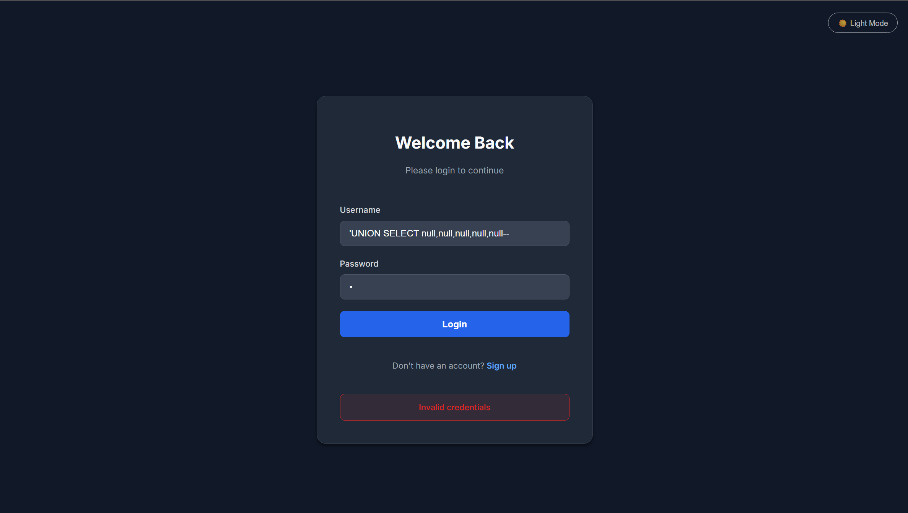
>
> 🖼️ **Beweis (Browser-Log):** Keine Daten im Response:
> 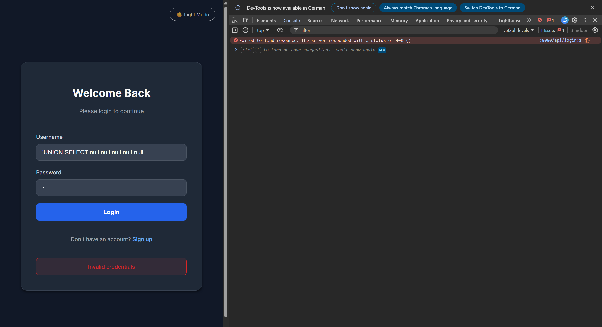
>
> 🖼️ **Beweis (Postman):** API verweigert die manipulierten Daten:
> 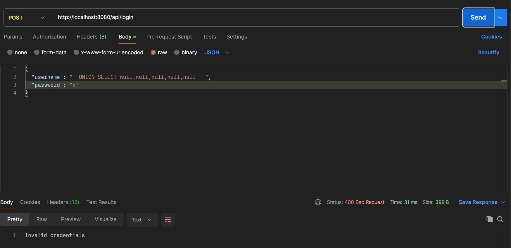
>
> 🖼️ **Beweis (Backend-Log):** Log zeigt saubere Parameter-Bindung:
> 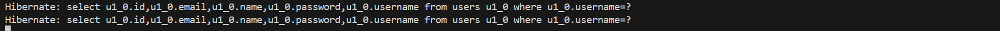

### Test 2: Erweiterte Injection
Ein weiterer Versuch mit einem komplexeren Payload, um Filtermethoden zu umgehen.

#### Testergebnis (Variante 2)
Auch dieser Angriff wird erfolgreich abgewehrt.

> 🖼️ **Beweis (Frontend):** Keine Auswirkung auf die Darstellung oder Daten:
> 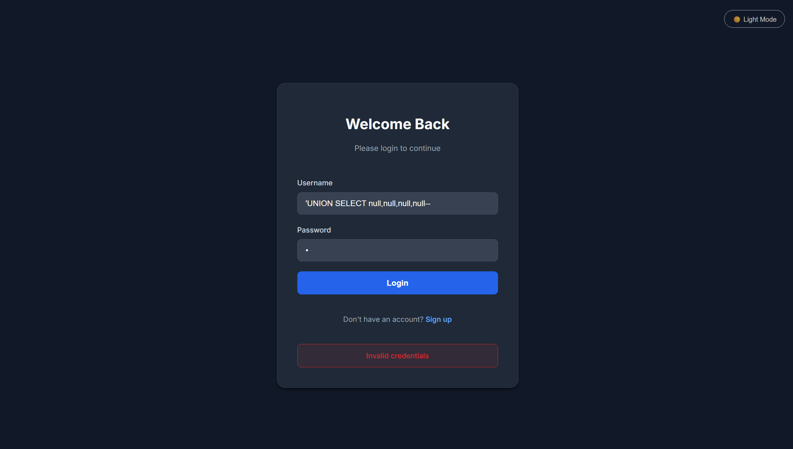
>
> 🖼️ **Beweis (Browser-Log):** Anfrage wird sicher verarbeitet:
> 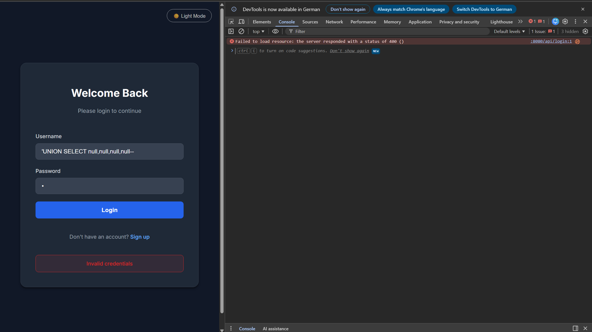
>
> 🖼️ **Beweis (Postman):** API bleibt stabil:
> 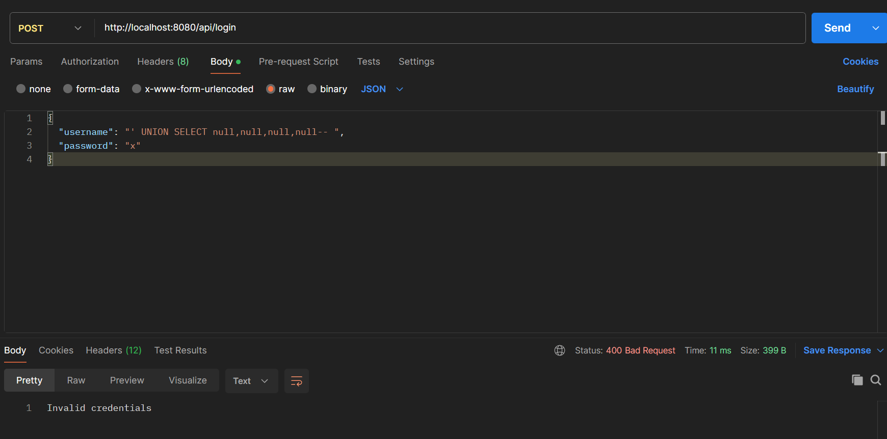

### Test 3: Data Extraction
Versuch, Daten aus der Datenbank mittels Data Extraction Techniken zu exfiltrieren.

#### Testergebnis (Sichere Version)
Der Angriff läuft ins Leere. Keine Daten werden ausgegeben.

> 🖼️ **Beweis (Frontend):**
> 
>
> 🖼️ **Beweis (Browser-Log):**
> 
>
> 🖼️ **Beweis (Backend-Log):**
> 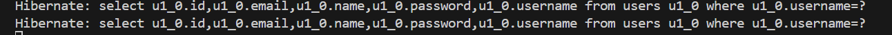

### Warum es fehlschlägt
Spring Data JPA verhindert generell strukturelle Änderungen an der Query ("Query Structure Tampering"). Der gesamte Input – egal wie komplex – wird als *Wert* für einen einzigen Parameter behandelt.

---

## 6. Verifizierung 4: Profilmanipulation (Update Injection)

Hier wurde versucht, durch Manipulation der Profil-Updates (Name, Email, etc.) andere Felder (wie das Passwort) unautorisiert zu ändern.

### 6.1 Szenario A: Update im Email-Feld
Versuch, im Email-Feld SQL-Code einzuschleusen, um das Passwort zu setzen.
- **Payload:** `test@example.com', password='HACKED`

#### Testergebnis
Der Angriff scheitert. Der SQL-Code wird nicht ausgeführt, sondern als Text gespeichert (oder abgelehnt).

> 🖼️ **Beweis (Resultat):**
> 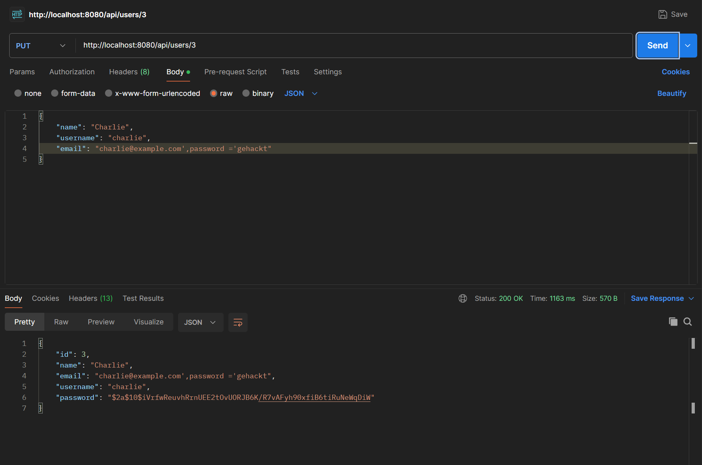
>
> 🖼️ **Beweis (Backend-Log):**
> 

### 6.2 Szenario B: Komplexe Payload-Variante
Ein weiterer Versuch mit einer variierten Syntax, um eventuelle schwache Filter zu umgehen.

#### Testergebnis
Auch hier greifen die Sicherheitsmechanismen von Hibernate/JPA.

> 🖼️ **Beweis (Postman):** Die Injection ist wirkungslos:
> 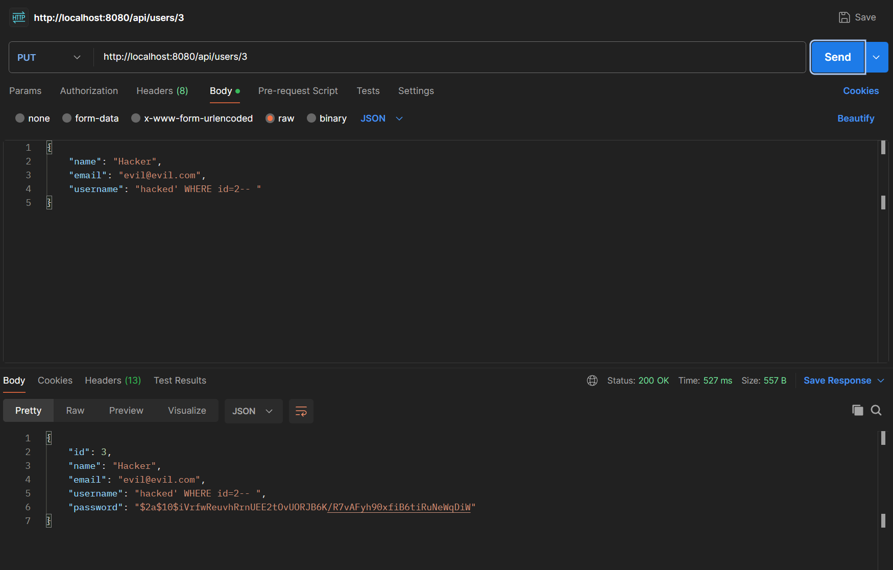
>
> 🖼️ **Beweis (Backend-Log):** Log bestätigt die sichere Verarbeitung:
> 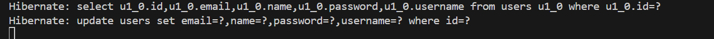

### Warum es fehlschlägt
Hibernate nutzt konsequent **Prepared Statements** für Update-Operationen:
```sql
UPDATE users SET email = ? WHERE id = ?
```
Der gesamte Payload (inklusive Kommas und SQL-Keywords) wird in den Parameter `?` eingefügt. Die Datenbankstruktur bleibt unverändert, und es ist unmöglich, aus dem vorgesehenen Feld auszubrechen und andere Spalten (`password`) zu manipulieren.

---

---

## 7. Verifizierung 5: Error-Based Injection (Fehlgeschlagen)

Wir prüfen, ob die Datenbank detaillierte Fehlermeldungen ausgibt, die für Angriffe genutzt werden können.

### Test 1
Versuch, einen SQL-Fehler zu provozieren.

> 🖼️ **Beweis (Frontend):**
> 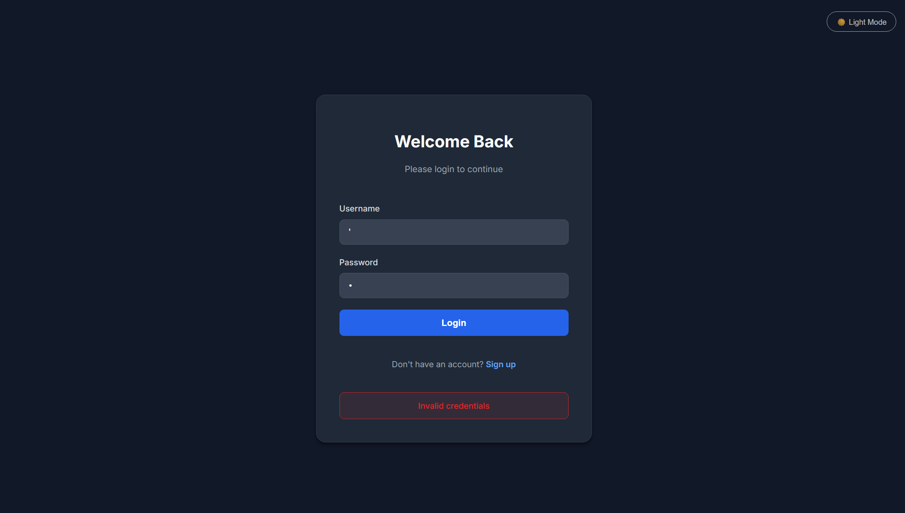
>
> 🖼️ **Beweis (Postman):**
> 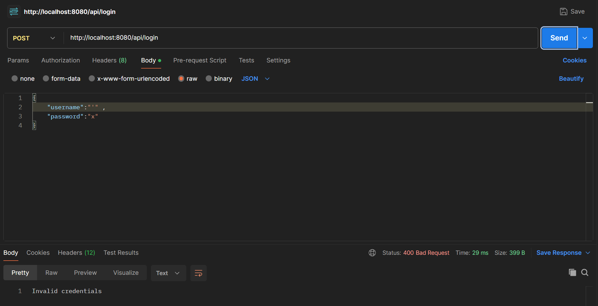
>
> 🖼️ **Beweis (Browser-Log):**
> 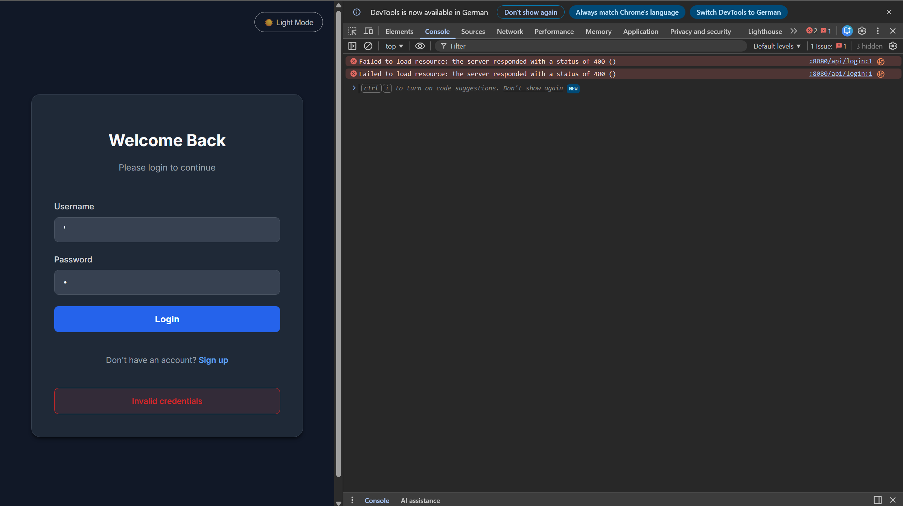
>
> 🖼️ **Beweis (Backend-Log):**
> 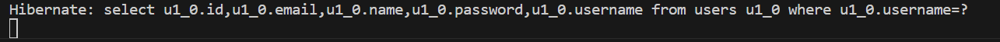

### Test 2
Zweiter Versuch mit einem alternativen Error-Based Payload.

> 🖼️ **Beweis (Frontend):**
> 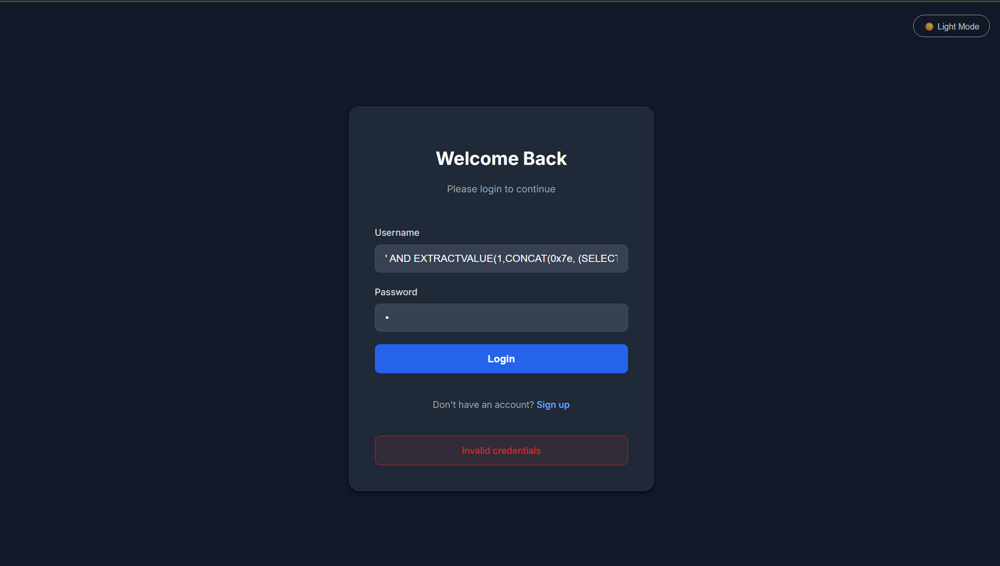
>
> 🖼️ **Beweis (Postman):**
> 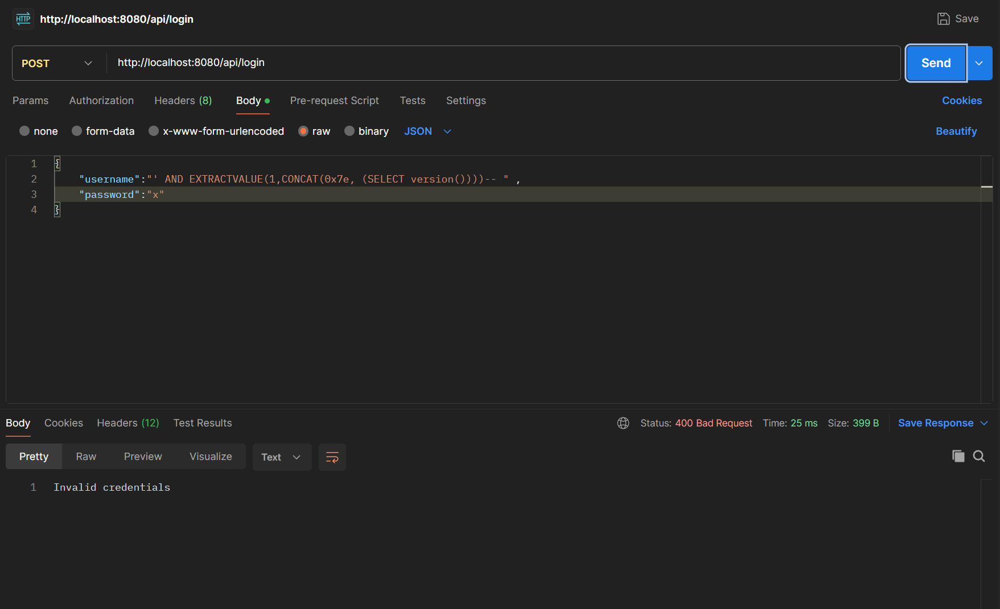
>
> 🖼️ **Beweis (Browser-Log):**
> 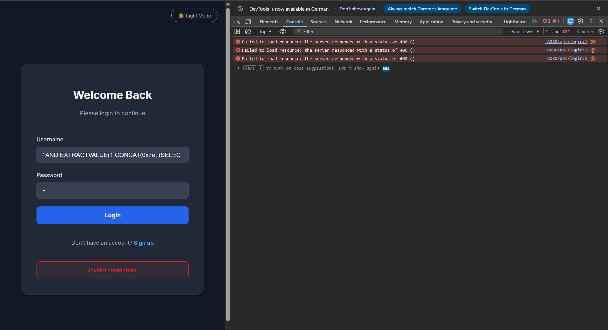
>
> 🖼️ **Beweis (Backend-Log):**
> 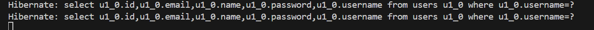

---

## 8. Ergebnis & Fazit

Die Sicherheitsmaßnahmen wurden erfolgreich verifiziert. Alle Angriffe, die in der unsicheren Version möglich waren, wurden wirksam unterbunden.

> 🖼️ **Gesamtergebnis:** Der finale Zustand zeigt keine Kompromittierung:
> 

### Zusammenfassung der Schutzmaßnahmen

1. **Login:** Sicher durch Prepared Statements (beide Union-Tests fehlgeschlagen).
2. **Profil:** Sicher durch JPA/Hibernate Objekt-Mapping (Beide Update-Manipulationsversuche fehlgeschlagen).
3. **Daten:** Keine Leakage, Integrität gewahrt.
